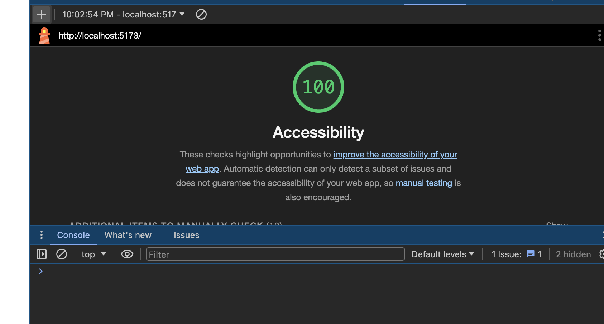
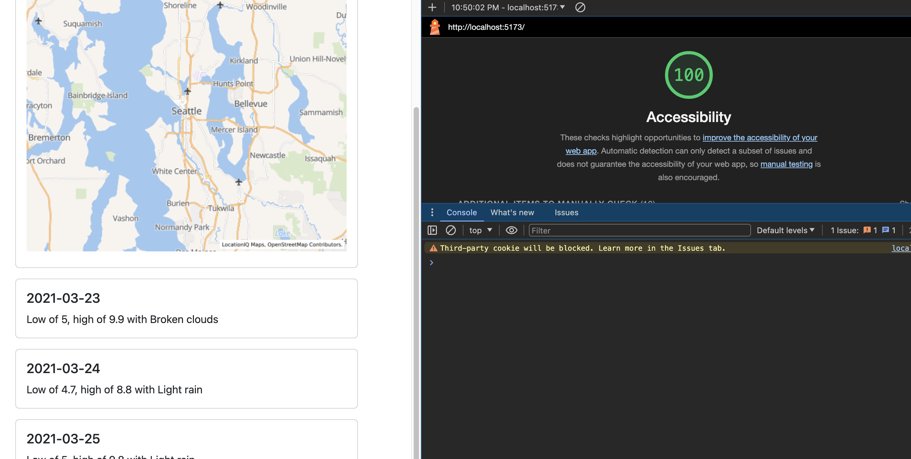
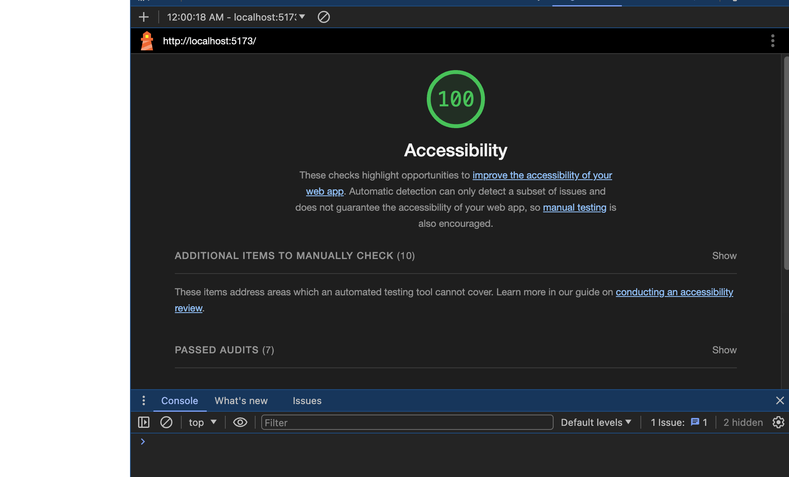

# City Explorer

**Author**: Evan Cheng
**Version**: 1.3.0

## Overview

The City Explorer Application, a React-based project, utilizes the Axios library to fetch data on demand from a third-party API, catering to travelers and the curious. It aims to fill the informational void about global cities, enhancing the discovery process with comprehensive details for its users. Beyond presenting textual information, it integrates visual maps to enrich the exploration experience, making it more immersive and insightful. This application serves as a practical resource for travel planning, geographical education, or virtual global exploration.

## Getting Started

1. Clone the Repository: Start by cloning the repository to your local machine. You can do this by running git clone in your terminal.

2. Install Dependencies: Navigate to the cloned directory and run npm install to install the necessary dependencies for the application to run.

3. Environment Variables: Create a .env file in the root of your project. You will need to obtain an API key from LocationIQ and add it to your .env file as VITE_LOCATION_ACCESS_TOKEN=<Your_LocationIQ_API_Key>.

4. Start the Application: Run npm start to start the application. This will launch the application in your default web browser.

5. Explore: Use the search functionality to explore cities and their detailed information including latitude, longitude, and a visual map.

## Architecture

React.js: A JavaScript library for building user interfaces, chosen for its efficiency and community support.  

Bootstrap: Utilized for styling and responsive design, allowing for a clean and modern user interface.  

LocationIQ API: Provides the geo-location data used to fetch and display information about the cities.
  
Vite: Serves as the build tool and development environment, known for its fast hot module replacement.

Axios: Used in React applications to make HTTP requests to external resources, such as APIs, enabling developers to easily fetch, post, and manage data from within their React components.

WeatherbitIO API: Provides real time weather forecast data for locations.

The Movie Database API: Provides movie information based off location data.

## Change Log

04-01-2024 10:00PM EST - Initial project setup with React and Vite.

04-01-2024 10:45PM EST - Integrated LocationIQ API for geo-location data fetching.  

04-02-2024 12:01 AM EST - Implemented Bootstrap for styling and responsive design.
  
04-02-2024 12:45 AM EST - Added error handling for city searches and environment variable setup for API keys.  

04-03-2024  - Integrate Weather API from back-end server.

04-03-2024 - Debug Weather function to properly link front and back-end

04-03-2024  - Implemented Movie API from back-end server
  
04-03-2024 - Added error handling for city searches, weather updates, and movie data.

## Credit and Collaborations

LocationIQ: Geo-location API that powers the primary functionality of this application.  

LocationIQ Bootstrap Documentation: For references on implementing responsive design elements.  

Bootstrap React Documentation: For best practices and guidance on React component structure.  

ChatGPT by OpenAI: For assistance in debugging, architectural decisions, and code optimization strategies.

## Time Estimates & Lighthouse Score

### 01 April 2024

Name of Feature: Setup & Initial Configuration

    Estimate of time needed to complete: 30 Minutes
    Start time: 10:00PM EST

    Finish time: 11:45PM EST

    Actual time needed to complete: 1 Hour 45 Minutes

Name of Feature: Integration with LocationIQ API

    Estimate of time needed to complete: 45 Minutes
    Start time: 10:45PM EST

    Finish time: 11:15PM EST

    Actual time needed to complete: 30 Minutes

Name of Feature: Display City Information & Error Handling and User Feedback

    Estimate of time needed to complete: 45 Minutes
    Start time: 12:45 AM EST

    Finish time: 01:30 AM EST

    Actual time needed to complete: 45 Minutes

Name of Feature: Styling with Bootstrap  

    Estimate of time needed to complete: 45 Minutes  

    Start time: 12:45 AM EST

    Finish time: 01:30 AM EST

    Actual time needed to complete: 45 Minutes  

### 02 April 2024

Name of Feature: Setup & Initial Configuration of Express Server

    Estimate of time needed to complete: 45 Minutes
    Start time: 3:30PM EST

    Finish time: 5:00PM EST

    Actual time needed to complete: 1 Hour 30 Minutes

Name of Feature: Front End Weather Information From The Server

    Estimate of time needed to complete: 1 Hour
    Start time: 9:45PM EST

    Finish time: 10:45PM EST

    Actual time needed to complete: 1 Hour  

### 03 April 2024

Name of Feature: Live Weather API from the Back-End Server

    Estimate of time needed to complete: 1 Hour
    Start time: 7:30PM EST

    Finish time: 10:45PM EST

    Actual time needed to complete: 3 Hour 15 Minutes

Name of Feature: Movie API from the Back-End Server

    Estimate of time needed to complete: 1 Hour
    Start time: 11:00PM EST

    Finish time: 11:30PM EST

    Actual time needed to complete: 30 Minutes
